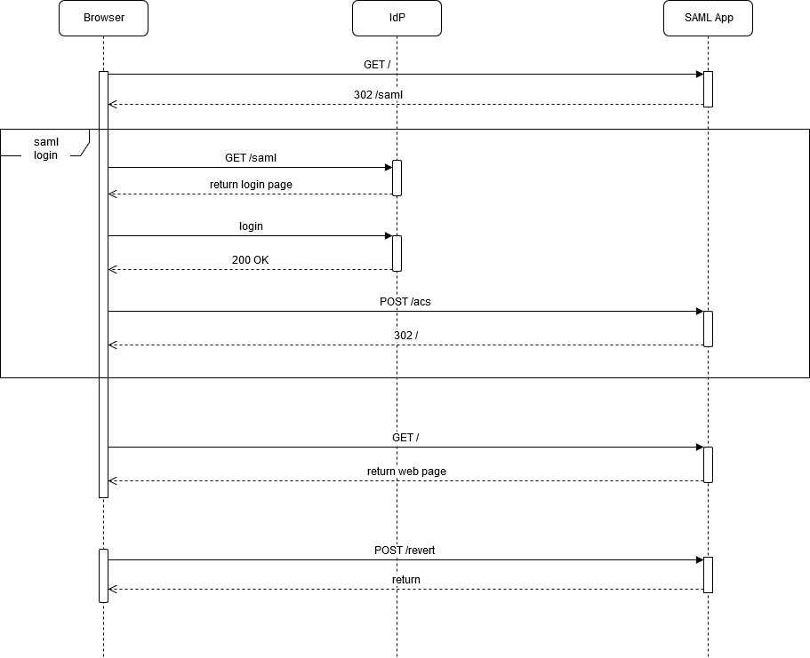

# SAML AND OIDC AUTHENTICATION PROTOTYPE

## INTRODUCTION
The aim of this prototype is to show how both SAML and OIDC authentication mechanisms can coexist in the same solution, whether SAML is used to authenticate the access to a web application (i.e. gosaml) while OIDC is used to authenticate an API call to another application (i.e. goapi).
Both authentication mechanisms are implemented using [Keycloak](https://www.keycloak.org/), but this solution includes more components such as [Nginx](https://www.nginx.com/) for path-based routing, [Keycloak Gatekeeper](https://github.com/keycloak/keycloak-gatekeeper) as OIDC reverse-proxy and [Kong](https://konghq.com/) as API Gateway.
To better explain the role that each component plains in this example solution, we'll adopt a step-by-step approach, by introducing each element one by one.  
The following pictures shows these components and how they are connected together:


## DEPENDENCIES
This example is based on a single Docker Compose file that includes all the services involved at each stage of the implementation. 
Use `git checkout` to switch from one stage to another, accordingly to each corresponding tag:
- 1-samlonly
- 2-oidc
- 3-nginx
- 4-kong

The following pictures shows how the container are instantiated in the final **docker-compose.yml** file and how their ports are mapped.
The browser interacts with ports 8000 and 8080, but the other ports can be used for test purposes.


### **DISCLAIMER**
**Please be aware that this solution is implemented for test and education purposes only and it should not be uses ad-is in production environments. In particular, to simplify the setup, secrets and passwords are stored in the configuration files, without any specific protections that are a 'must-have' requirement for production environments.**


## STARTUP
As Keycloak takes a while to startup, it's better to start it before the other containers and wait till it's up and running:

```console
docker-compose up -d test-oidc
```

Ensure that Keycloak is up and running by looking its logs:

```console
docker-compose logs -f test-oidc
```

You should see something like the following:

```
oidc | 08:29:17,535 INFO  [org.jboss.as] (Controller Boot Thread) WFLYSRV0060: Http management interface listening on http://127.0.0.1:9990/management
oidc | 08:29:17,535 INFO  [org.jboss.as] (Controller Boot Thread) WFLYSRV0051: Admin console listening on http://127.0.0.1:9990
oidc | 08:29:17,536 INFO  [org.jboss.as] (Controller Boot Thread) WFLYSRV0025: Keycloak 7.0.0 (WildFly Core 9.0.2.Final) started in 42509ms - Started 682 of 987 services (701 services are lazy, passive or on-demand)
```

You can also open the Keycloak Admin console at the link [http://localhost:8080/auth/](http://localhost:8080/auth/)

## STOP EVERYTHING BUT OIDC
With Docker Compose you can stop and remove one or more containers at once, using the following command:

```console
docker-compose rm -f -s test-gatek test-nginx test-apigw test-gosaml test-goapi
```

This is especially useful whenever you want to make a change on any of them without restarting the Keycloak server.
Instead, if you want to stop everything, use the following command:

```console
docker-compose down
```

## USERS AND PASSWORDS
The following users are defined in the Keycloak server:
- admin/password
- pippo/pippopippo
- paperino/paperinopaperino


## 1-SAMLONLY
Start the SAML application (gosaml).

```
docker-compose up -d test-gosaml
```

Once the application is started, open the browser at the link [http://gosaml.lvh.me:8000/](http://gosaml.lvh.me:8000/). You'll be redirected to the Keycloak login page as the application requires a SAML-based authentication.
Provide username and password (pippo/pippopippo) to login and the browser should open a simple web page where you can enter some text. When you press the **OK** button, the web application sends the text to the server that, in this implementation, will just reply with the text *this is the default implementation*.
In further stages of this solution, this back-end API will be replaced with a different implementation that will revert the word order of the text provided in the input field. The Nginx component will route the API call to this second implementation.



## 2-OIDC
In this second stage we introduce Keycloak Gatekeeper as security proxy, to inforce the OIDC authentication before calling the SAML application. Behind the scene a double authentication in in place, involving a single sign-on scenario, even if the user won't notice it as only one login is requested.

Stop the further solution, if needed, then start this new one once test-oidc is running again:

```
docker-compose up -d
```

The following sequence diagram shows the interation between the three involved components:


## 3-NGINX
In the third stage we introduct two additional components:
- **goapi** that implements the revert API by actually reverting the word order of the sentence writte in the input field of the webpage
- **nginx** that routes any call to the revert API to the goapi component instead of the gosaml

The API call will actually include the OIDC Bearer token but no actual authentication check is done in goapi. For this reason in the next stage we'll introduce the **Kong** API Gateway to enforce the authentication, assuming goapi is not directly protected by the gatek reverse proxy.

The following sequence diagram shows the interaction between all the involved components at this stage:


## 4-KONG
This is the final stage, where also Kong API Gateway is introduced to protect the access to the goapi application, by verifying the OIDC Bearer token that the gatek reverse proxy introduces in the **Authorization** HTTP header.
Since the basic **jwt** Kong plugin is used, we have to declare Keycloak's public key in the **kong.yml** file.

The following sequence diagram shows the interaction of all the components of this solution:


